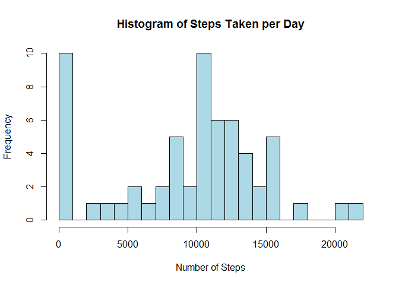
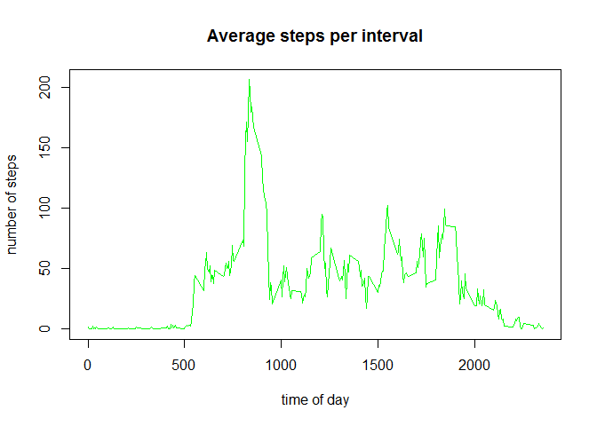
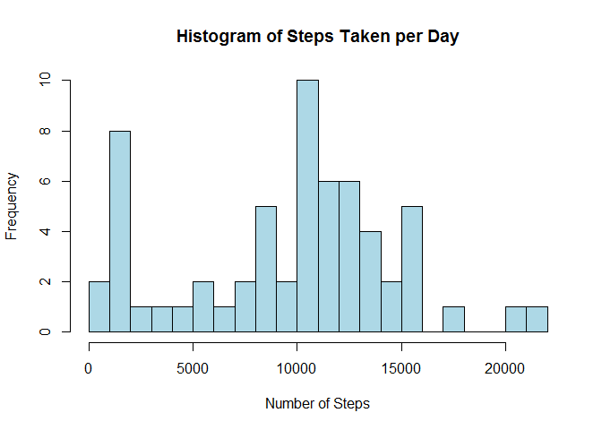
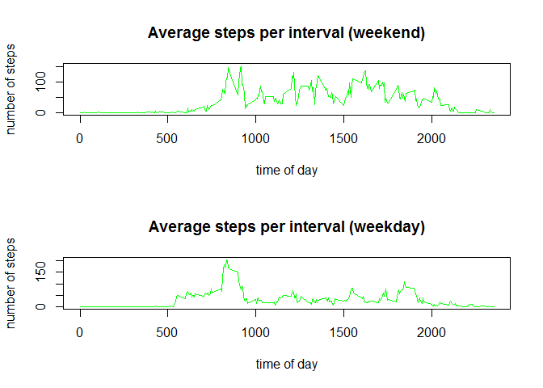

# Reproducible Research: Peer Assessment 1


## Loading and preprocessing the data

First of all, let's read in the data.  Note: we're assuming the CSV file is in our working directory.


```r
setwd("~/Bluefin/R Working Directory/represearchproj1")
activitydata <- read.csv(unz("activity.zip", "activity.csv"))
```

Next, we want to convert the date field, which is stored as text, to be of the R "date" type.


```r
activitydata$date <- as.Date(activitydata$date,"%Y-%m-%d")
```

## What is mean total number of steps taken per day?


Now, use ddply to get the number of steps by day.  Of course, we'll have to use the plyr library for this.


```r
library(plyr)
```

```
## Warning: package 'plyr' was built under R version 3.1.3
```

```r
activitybyday <- ddply(activitydata,~date,summarise,tot=sum(steps,na.rm=TRUE))
```

The following histogram shows the distribution of the number of steps taken in a day.


```r
hist(activitybyday$tot,breaks=20, col="lightblue", main="Histogram of Steps Taken per Day", xlab="Number of Steps")
```

 

Now we're going to get the mean and the median.


```r
mean1 <- mean(activitybyday$tot)
mean1
```

```
## [1] 9354.23
```

```r
median1 <- median(activitybyday$tot)
median1
```

```
## [1] 10395
```

The mean number of steps taken per day is 9354.2295082.

The median number of steps taken per day is 10395.

## What is the average daily activity pattern?

Again, we use ddply, this time to calculate the average number of steps in each interval. Then we can draw a plot to show how the activity varies, on average, throughout the day.


```r
activitybyinterval <- ddply(activitydata,~interval,summarise,average=mean(steps,na.rm=TRUE))
plot(activitybyinterval$interval, activitybyinterval$average,type = "l", col="green", main="Average steps per interval",xlab="time of day", ylab="number of steps")
```

 

To find out the exact interval in which the participant is most active, sort the data frame by number of steps (highest to lowest), and then take the first column in the top row. 


```r
sorted <- activitybyinterval[with(activitybyinterval,order(-activitybyinterval[,"average"])),]
mostactiveinterval <- sorted[1,1]; mostactiveinterval
```

```
## [1] 835
```

This tells us that the most busy interval, on average, was 835.

## Imputing missing values

Let's see how many rows have missing values, and for comparison, how many rows are in the data set in total.


```r
missingactivitydata <- subset(activitydata,is.na(steps),select=c("interval","date"))
missingvalues <- nrow(missingactivitydata); missingvalues
```

```
## [1] 2304
```

```r
allvalues <- nrow(activitydata); allvalues
```

```
## [1] 17568
```

So there are 2304 missing values, out of a total of 17568.

To fill in the missing values, calculating a mean or median for each *day*, and then applying the day's mean or median to missing values in that day isn't going to be a satisfactory approach.  Partly this is because there are intervals that are consistently zero or close to zero, when the subject is usually asleep, but mostly because there are entire days that are entirely populated with missing values, so calculating a mean or median per day isn't going to give us a full data set with which to fill the missing values.

So intead, let's calculate a median value for each interval across the two months of sampled data.


```r
mediansteps <- ddply(activitydata,~interval,summarise,steps=median(steps,na.rm=TRUE))
```

We already created a data frame that contains the interval and date for rows with missing values.  Let's do a lookup from that table onto our set of median values.


```r
lookedupactivitydata <- merge(missingactivitydata,mediansteps,by="interval")
```

Now we can combine the data that has valid "steps" data with the rows that had missing values and now use the interval median.


```r
completeactivitydata<-subset(activitydata,!(is.na(steps)))
completeactivitydata<-rbind(completeactivitydata,lookedupactivitydata)
```

We can now replicate the histogram above, and recalculate the mean and median to see the impact of imputing the missing data.


```r
activitybyday <- ddply(completeactivitydata,~date,summarise,tot=sum(steps,na.rm=TRUE))
hist(activitybyday$tot,breaks=20, col="lightblue", main="Histogram of Steps Taken per Day", xlab="Number of Steps")
```

 

```r
mean2 <- mean(activitybyday$tot)
mean2
```

```
## [1] 9503.869
```

```r
median2 <- median(activitybyday$tot)
median2
```

```
## [1] 10395
```

The mean number of steps taken per day is 9503.8688525 (compared to the previous value of 9354.2295082).

The median number of steps taken per day is 10395 (compared to the previous value of 10395).

Imputing the missing values has increased the mean slightly.  The median result has not changed.

## Are there differences in activity patterns between weekdays and weekends?

To analyse and compare the difference in typical activity between the weekend and the working week, we will split the data into two data frames, one ("weekenddata") holding the data for Saturdays and Sundays and the other ("weekdaydata") holding the data for Mondays to Fridays.


```r
completeactivitydata$day <- weekdays(completeactivitydata$date)
completeactivitydata$daytype <- ifelse(
    (completeactivitydata$day == "Saturday") | (completeactivitydata$day == "Sunday"),
    "weekend",
    "weekday")
activitybyinterval <- ddply(completeactivitydata,.(interval,daytype),summarise,average=mean(steps,na.rm=TRUE))
weekenddata <- activitybyinterval[activitybyinterval$daytype=="weekend",]
weekdaydata <- activitybyinterval[activitybyinterval$daytype=="weekday",]
```

Now we can plot these separate data sets against each other.


```r
par(mfrow=c(2,1))
plot(weekenddata$average~weekenddata$interval,type = "l", col="green", main="Average steps per interval (weekend)",xlab="time of day", ylab="number of steps")
plot(weekdaydata$average~weekdaydata$interval,type = "l", col="green", main="Average steps per interval (weekday)",xlab="time of day", ylab="number of steps")
```

 

We can see a clear difference between the subject's activity at the weekend and his/her activity during the week.  During the week, activity begins shortly after 5AM, and peaks at around 9AM before falling to a relatively low and consistent level throughout the day.

At the weekends, the subject rises later, but is more active throughout the day than he/she is during the week.
